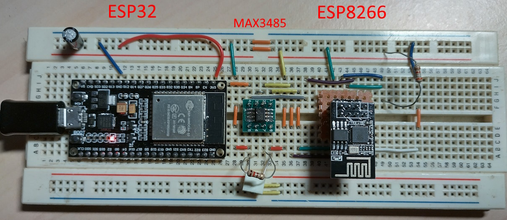
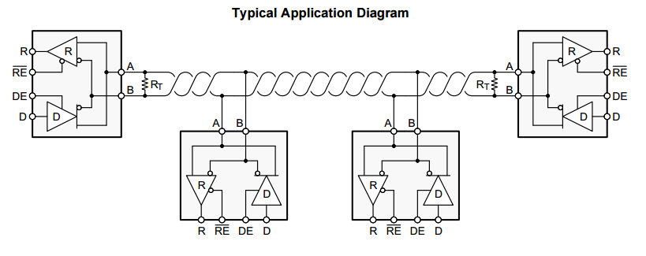
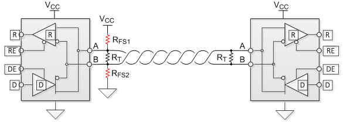

# WiFi Modbus TCP-RTU bridge for Arduino

A universal fully-fledged [Modbus](https://en.wikipedia.org/wiki/Modbus) RS485-to-WiFi bridge specifically designed for MCU with embedded WiFi support (like ESP32 / ESP8266).

## Features

- Support for multiple TCP client connections, with a FIFO queue behavior
- Universal gateway support for all Modbus messages, acts as raw level
- Support for Modbus timeout error in case of RTU missing response
- Support for precise timing of the Modbus protocol framing via MAX485 line driver w/ specific enable line
- Remove logging via TCP socket (telnet)
- Custom handlers for error recovery and support for non-standard RTU responses
- Watchdog support of the Modbus library

The library was fully tested on ESP32 and ESP8266, but it should be compatible on all Arduino platforms. 

The Modbus library used is the [modbus-esp8266](https://github.com/emelianov/modbus-esp8266).

<em>Test board with both MCUs and a bare MAX3485 on a socket</em>

## Implementation details

The bridge leverages the hardware support of the Arduino-supported MCUs, and specifically:

- The hardware UART for the RTU line
- GPIO for the MAX485/MAX3485 driver output enable line
- WiFi stack
- Timer with millisecond precision

In addition, continuous real-time logging is exposed via a TCP port that can be opened by a client, by default set to the telnet port 23 (to easily leverage the `telnet` app itself).

## Notes about Modbus timings and bus arbitration

The Modbus RTU bus is a multi-master bus based on [RS485](https://en.wikipedia.org/wiki/RS-485#Applications), that must be driven by only one nodes at a time.

The node arbitration require precise timing to avoid the bus to float, and so to generate spurious "start bits" that can trigger erroneous byte receive in the UART.

### Avoid glitches via timing

A common way to avoid such glitches is to use an _inter-frame time_ (of 3.5 characters time) in which both primary and secondary node drives the RS-485 line to unasserted state.

For example:
- The primary node stops drive the line after 2 characters time (means 2.3ms over `9600-8N1`)
- The secondary addressed node start driving the line after 0.5/1 character time (means <1ms over `9600-8N1`), and start transmitting data after 3.5 characters time (4ms over `9600-8N1`).

### Avoid glitches via electric biasing

It is instead possible to bias the line pulling it down near the terminators, in order to force the level to be read as low during the inter-frame blank.

However this solution limits the number of nodes that can be present on the bus and the maximum length of the line itself.

[More details about bias resistor calculations](https://www.deltamotion.com/support/webhelp/rmctools/Communications/Serial/Configuration_and_Wiring/RS-485_Termination_and_Biasing.htm)

